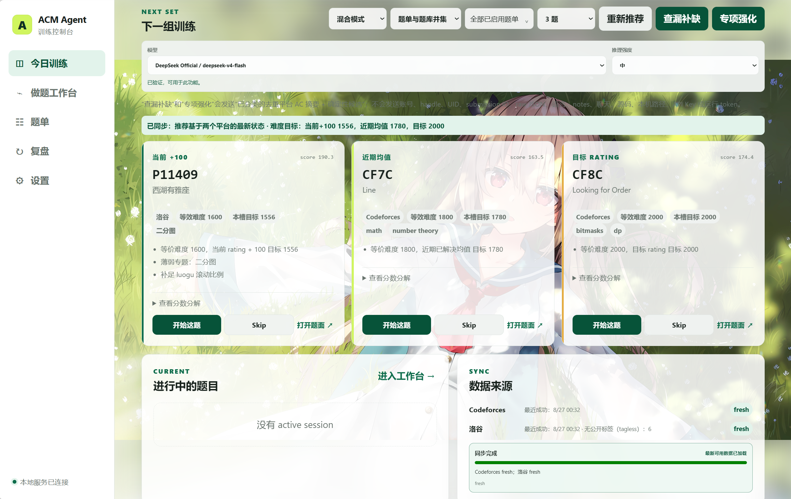
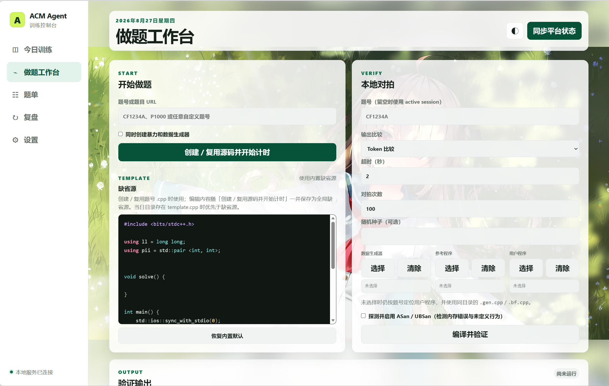
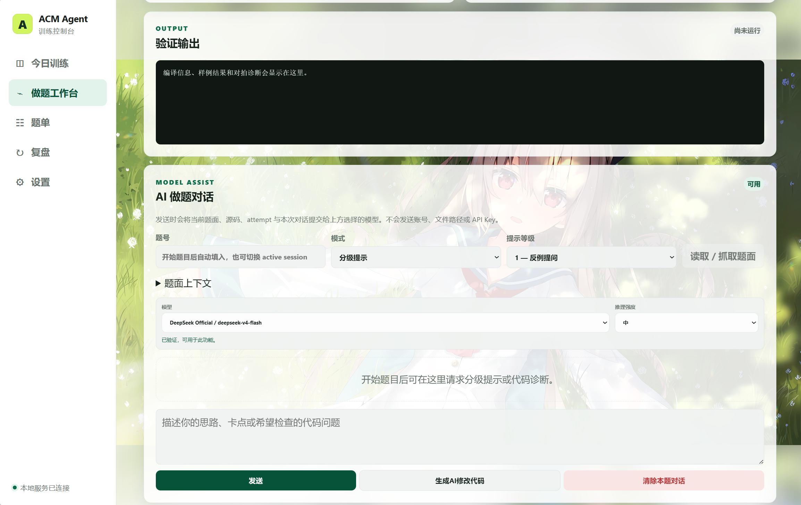
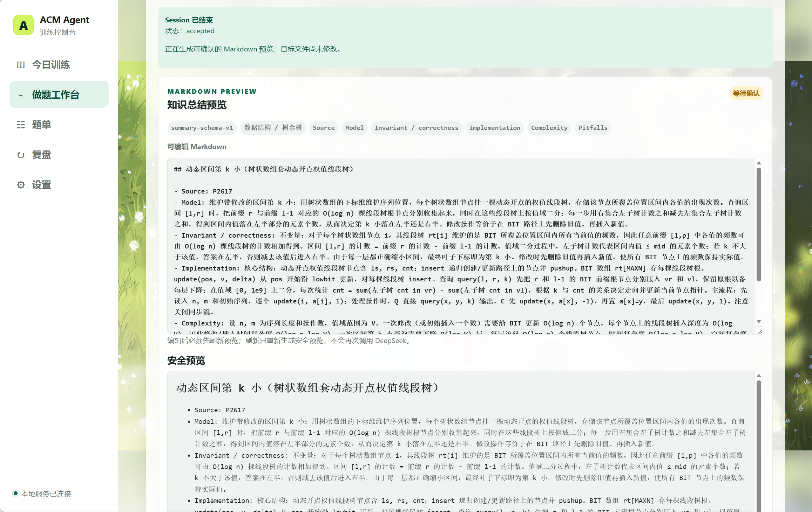
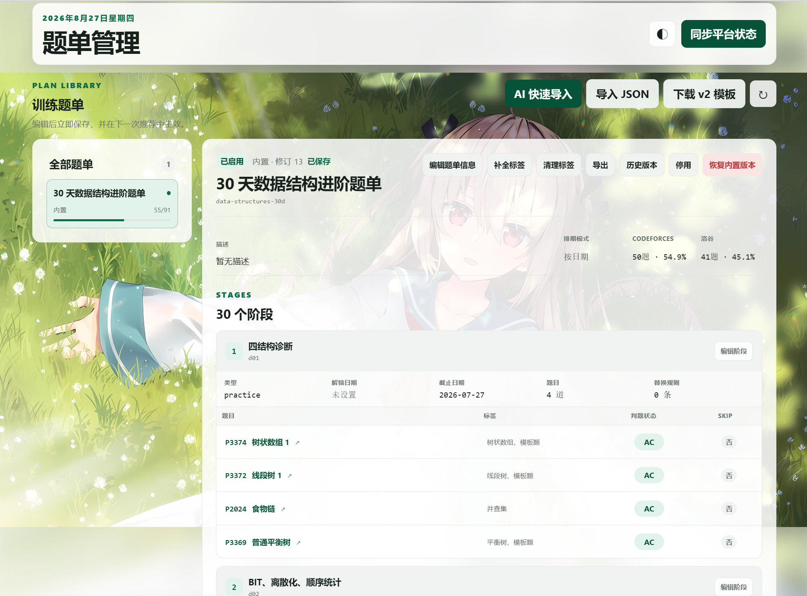
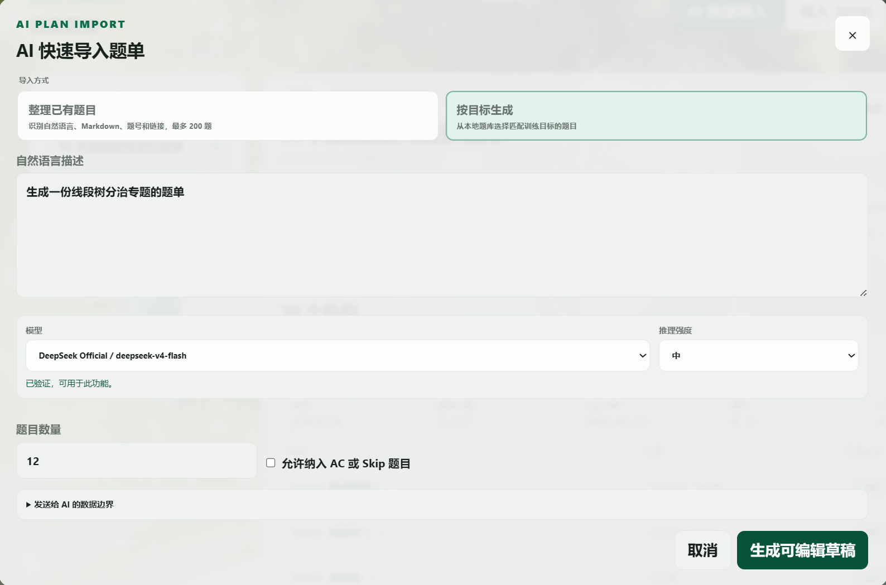
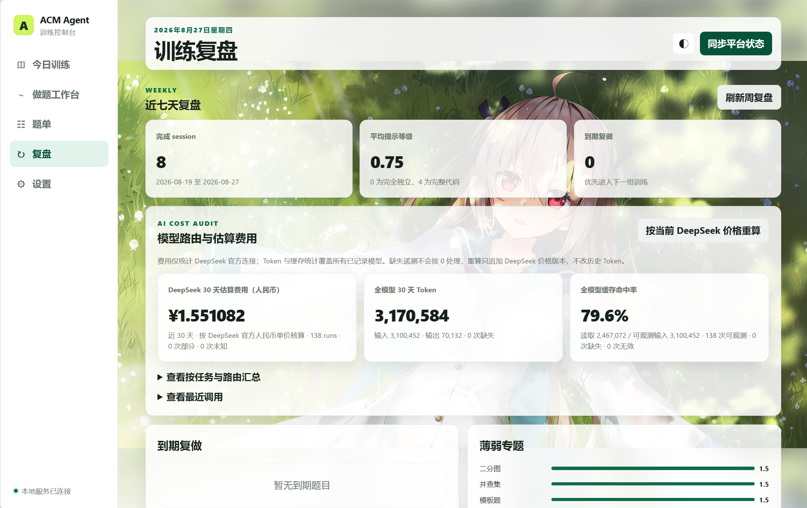
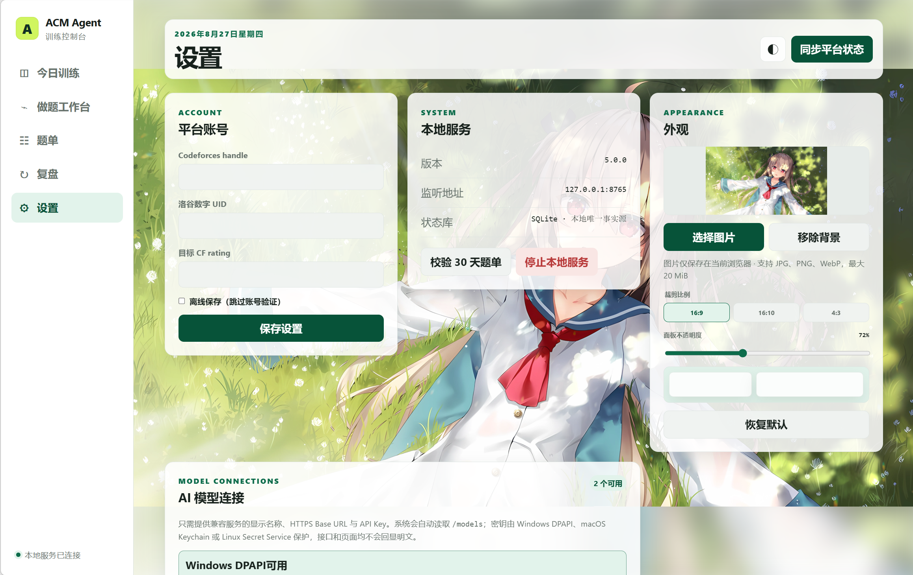
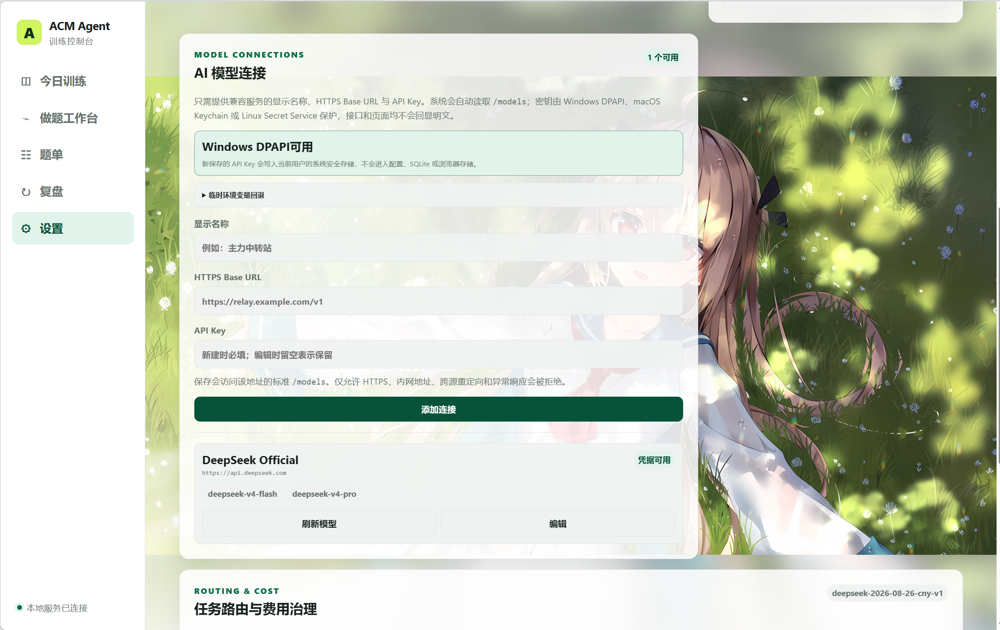

# ACM Agent

一个 local-first 的 ACM/ICPC 训练控制台。它把 Codeforces、洛谷公开做题状态、训练题单、可解释推荐、C++ 验证、复盘与可选 AI 辅助统一到本地 SQLite 中。

核心服务兼容 Python 3.10 及以上正式版，无需 npm 或外部数据库；Linux/macOS Dashboard 的系统凭据存储依赖由启动器隔离管理，网页只监听 `127.0.0.1`。

当前发布版本：`6.1.0`。

> 下文截图使用隔离的演示工作区，不包含个人账号、真实提交记录、源码路径、API Key 或运行令牌；五个主界面的截图分别放在对应功能介绍处。

## 核心能力

- 同步 Codeforces 官方 API 与洛谷公开页面；失败时保留最后一次成功快照。
- 按难度目标、薄弱专题、复做到期、近期重复与平台平衡生成可解释推荐。
- 严格区分 `accepted`、`attempted`、`local_only` 和“已掌握但未实现”的 `skipped`。
- 管理多份渐进式题单，支持 JSON 导入、AI 快速导入、编辑、启停、导出和修订恢复。
- 创建并复用 `YYYY/M/D/题号.cpp`，完成 C++17 编译、样例检查、sanitizer 探测与有限本地对拍。
- 可选 AI BYOK：内置 DeepSeek 与自定义 OpenAI-compatible HTTPS 连接，支持知识覆盖推荐、按题保存的渐进提示、代码诊断/补丁与 Markdown 总结。
- 自定义控制台背景、裁剪比例和面板透明度；图片只保存在当前浏览器。
- 提供同一套本地网页 API、CLI JSON 与仓库级 `acm-workflow` skill，便于 Agent 协作。

## 环境要求

- Python 3.10 或以上正式版
- 现代浏览器
- 可选：支持 C++17 的 `g++`，仅在编译和验证时需要
- 在线同步或 AI 功能所需的网络连接

## 快速开始

Windows：

```powershell
.\acm.ps1 web
```

也可以双击 `start-acm-web.cmd`。

Linux / macOS：

```bash
chmod +x acm.sh start-acm-web.sh
./start-acm-web.sh
```

四个 Web 入口（`start-acm-web.cmd`、`.\acm.ps1 web`、`./start-acm-web.sh`、`./acm.sh web`）都会先检查可用的 Python 正式版，并直接复用任意 Python 3.10 或以上环境。只有不存在合格环境时才循环询问是否安装：输入 `y` 联网安装固定的 Python 3.13.15，输入 `n`、标准输入结束或不可交互时安全退出，不会启动 Web。

- Windows 固定安装 Python 3.13.15 到当前用户，不替换系统 Python、无需管理员权限；安装包优先从华为云镜像下载，失败后回退至 python.org，并在执行前校验官方 SHA-256。
- Linux（glibc/musl，x86_64/ARM64）和 macOS（Intel/Apple Silicon）使用固定版 uv 安装托管的 Python 3.13.15。项目内 `.acm/runtime/bootstrap` 已有可执行的目标 uv 时优先复用；项目文件损坏或版本不符时只替换该文件并重新下载校验。项目文件不存在时，全局 uv 恰好匹配固定版本才会复用；未安装或版本不同则下载固定版到项目目录，不升级、不卸载全局 uv，也不修改 PATH。uv 国内镜像下载或 SHA-256 校验失败时回退 GitHub，两个源都失败便终止 Python 安装，绝不使用不匹配的全局版本。Python 运行时优先使用 npmmirror，失败后回退官方源。该流程不调用 `sudo`、不修改 shell profile、PATH 或系统 Python。FreeBSD、OpenBSD、Solaris 等其他 Unix 暂不支持自动安装。
- Unix Dashboard 的系统安全存储依赖由 `requirements-web-unix.in` 以 Python 3.10 为下界做 universal resolution，再生成完整、固定版本且带哈希的锁；启动器仍强制 `--require-hashes --only-binary=:all:`，并在标记环境可复用前实际导入对应 keyring 后端，避免某个 Python ABI 或条件传递依赖被锁文件遗漏。

已有任意正式版 Python 3.10 或以上环境时会直接复用。自动安装完成后还会检查 `sqlite3`、`ssl` 等 Web 所需标准库；`tkinter` 缺失不阻止核心 Dashboard 启动，但原生文件选择器及相关操作会提示不可用。

Linux/macOS 的 Web 入口会用固定且带 SHA-256 的 lock，在 `.acm/runtime/web-envs` 创建项目隔离环境并安装 Python 侧的系统凭据存储依赖。ready 环境会按解释器 ABI、lock 摘要和精确包版本离线复用；不会写入系统 site-packages 或修改 PATH/shell profile。依赖下载、哈希或版本校验失败时，启动器会告警并用基础 Python 继续启动核心 Dashboard，此时 Unix 安全存储不可用并在下次启动重试。仅在 Debian/Ubuntu、存在 `apt-get` 且 Secret Service 探测失败时，启动器会询问是否原样执行 `sudo apt-get install --no-install-recommends gnome-keyring seahorse`；拒绝、EOF、安装失败或安装后复探测失败都不阻止核心 Dashboard，也不会改变凭据持久化的 fail-closed 行为。普通 `./acm.sh` CLI 命令继续直接使用系统 `python3`，不会触发这些依赖。

服务默认在 `127.0.0.1:8765`–`8775` 中选择可用端口并自动打开浏览器。首次使用时填写 Codeforces handle、洛谷数字 UID 和可选的目标 CF rating；验证后立即进入主界面，常驻同步卡会显示平台、阶段、完成计数和已用时间。洛谷公开 AC 会先变为可用，完整目录与标签继续在后台补齐；刷新或重新打开页面仍可恢复进度。新鲜全局目录会复用，洛谷分页与标签抓取采用保守的有界并发和失败退避；公开题面没有标签时记为 `tagless`，不误报为 partial。离线保存不会验证账号或同步平台状态。

## 题目推荐逻辑

“今日训练”展示三槽位目标、可解释分数、来源题单与开始/Skip 操作：




确定性推荐按三题一组循环：

1. **当前 +100**：当前 CF rating 加 100。
2. **近期均值**：Codeforces 与洛谷各取最近最多 50 道不同已解决题，换算后合并求平均。
3. **目标 Rating**：设置中的目标 CF rating。

当前 rating 缺失时，基准依次回退到近期均值、目标 rating、1600；近期均值只统计存在可换算难度的已解决题。近期或目标数据缺失时，对应槽位复用“当前 +100”。

每个槽位先比较题目与目标难度的距离，再结合薄弱专题、复做到期、近期重复和平台平衡决胜。推荐卡会展示目标难度、总分、分项和选择原因。

平台 AC 与本地明确记录的 `close --result AC` 都算已解决；重复 AC 只计一次。源码文件存在仅表示 `local_only`，不会被误判为 AC。新题推荐排除 AC 与 active Skip，复习模式只选择到期的 AC 题。

默认 `balanced` 将题单与平台题库合并为普通候选池。题单身份、日期和 Level 只控制资格与展示，不额外加权；也可切换为仅题库或仅题单。

可选 AI 推荐提供两种模式：

- **查漏补缺**：优先覆盖不同 AC 题数较少的知识板块。
- **专项强化**：优先深挖已有较多 AC 的知识板块。

AI 只能在确定性候选池内选择和排序，不能恢复 AC/Skip 题、绕过来源约束或创造题号；每个槽位只允许在目标难度正负 100 CF 等效分内重排。模型或协议失败时会优先尝试同模式的 hybrid/确定性回退；只有完整本地业务校验通过时结果才可用，否则返回结构化 `unavailable`。

## 一次训练闭环

“做题工作台”统一提供源码创建/复用、编译验证、对拍文件选择、AI 对话与结束复盘：



1. 同步平台状态并生成下一组训练。
2. 从推荐卡或工作台启动题目；当天目录已有同名源码时直接复用且不覆盖，只有旧日期存在同题源码时仍会创建当天的新文件。
3. 在 `.acm/cases/<problem-key>/` 放置样例并运行验证。
4. 可选使用按题隔离的 AI 对话，请求 1–3 级提示或 4 级代码诊断；补丁始终先预览、再确认应用。
5. 结束时记录结果、独立思考时间、最高提示等级、失败类型和备注。
6. 在复盘页查看到期复做、近七天结果、薄弱专题和 Skip 列表；Markdown 总结需要单独预览并确认写入。



未显式选择文件时，对拍使用当前源码同目录的 `<ID>.bf.cpp` 与 `<ID>.gen.cpp`；工作台也可通过原生选择器指定现有的用户程序、参考程序和生成器。可通过 `--stress-iterations` 与 `--seed` 控制规模和复现种子。输出不一致时，最新 `.stress.in`、`.reference.out` 与 `.user.out` 优先保存在源码旁；生成器、运行时或输出上限错误的详细诊断与复现命令保存在 `.acm/failures/`，源码旁写入失败时也回退到该目录。



## 题单管理与 AI 导入

“题单”界面管理多份题单、阶段、题目、标签、启停状态与修订历史：



题单页的“AI 快速导入”提供两种显式模式：

- **整理已有题目**：从自然语言、Markdown、题号或官方链接中识别并去重，最多 200 题。模型只负责标题、分组主题、截止日期和输入题号的严格排列；说明、Level、note、稳定键与最终 canonical 结构均由本地服务生成，不能增加、遗漏或重复题目。
- **按目标生成**：根据训练目标提出公开题号，默认 12 题、最多 30 题；服务端再按本地目录与完成状态过滤。进行中题目始终排除，AC 与 Skip 默认排除，生成过程不会隐式联网同步。

两种模式都遵循同一条写入链：

```text
AI 生成草稿 → 本地校验 → 用户编辑 → 重新校验 → 显式确认导入
```

AI 预览不会创建题单文件或题单数据库记录，但会保留必要的 job、AI run 与缓存审计状态。题数不足时会保留可编辑的部分草稿，但禁用直接导入；题单 revision 冲突时必须重新预览，不会覆盖较新的修改。

调用前，界面会说明发送边界：两种模式都会发送用户主动输入的目标文本；整理模式还会发送已识别题目的公共名称和平台原始标签。生成模式首轮发送目标文本、题数、支持平台和 JSON 约束；补题轮次还会发送此前接受和排除的题号及剩余数量，但不会发送排除原因或本地完成状态。两种模式都不会发送账号、UID、提交详情、源码、聊天、现有题单、本机路径、API Key 或运行 token。



## 训练复盘

“复盘”界面汇总近七天 session、平均提示等级、到期复做、薄弱专题、结果/失败分布、Skip 记录与模型路由费用审计：



## 设置与外观

“设置”界面集中管理平台账号、本地服务、浏览器外观和 AI 模型连接：



“设置 → 外观”支持：

- 选择 JPG、PNG 或 WebP 图片，最大 20 MiB。
- 按 `16:9`、`16:10` 或 `4:3` 裁剪，并调整取景与缩放。
- 将内容面板不透明度设置为 60%–92%。
- 一键移除背景或恢复默认外观。

背景图片和外观参数只保存在当前浏览器的本地存储中，不写入 SQLite，也不会上传到服务端。界面使用清晰前景与模糊填边适配不同宽高比，并为窄屏、减少透明度和强制高对比度提供降级显示。

## AI 模型 BYOK



AI 功能只在用户显式点击或执行 AI 命令时调用。Dashboard 可直接保存 DeepSeek 或 OpenAI-compatible 中转站 API Key：Windows 使用当前用户作用域的 DPAPI，macOS 使用系统 Keychain，Linux 使用 Freedesktop Secret Service。密钥只会在受认证的 loopback 凭据请求体中短暂传递；不会写入 JSON 配置、SQLite、日志、浏览器存储、后台 job 或 API 响应。系统安全存储缺失或锁定时拒绝持久化，仍可临时使用进程环境变量，绝不退化为明文落盘。Debian/Ubuntu 的 Web 启动器只在探测失败且用户确认后调用交互式 `sudo` 安装 `gnome-keyring` 与图形管理器 `seahorse`；不执行 `apt update`、不代输密码、不启动或解锁服务。安装后会重新探测 D-Bus 服务并执行一次不包含敏感数据的 keyring 可用性检查；若仍失败，会明确提示“需启动/解锁用户钥匙环”。`libsecret-tools` 仅作为可选诊断工具，不自动安装。

内置 DeepSeek 连接支持 `deepseek-v4-flash` 与 `deepseek-v4-pro`；托管 OpenAI-compatible 连接只能使用已发现且通过能力验证的模型。推理强度中的“Provider 默认”不会下发 thinking/reasoning 控制字段，“关闭”才会显式关闭推理；推荐、对话、补丁、题单与 Markdown 总结按各自 profile 运行，provider reasoning 内容不展示也不保存。

工作台对话按 active attempt 与题目隔离并持久化。清除对话会归档旧会话而非删除审计事实；补丁应用和回退都受源码哈希保护，外部修改发生后不会被覆盖。

### AI 缓存

Stage 4 将三层指标严格分开：DeepSeek KV cache 只按 provider 返回的 cached tokens 计量；本地精确缓存只复用已通过当前 validator 的结构化产物；语义响应缓存始终禁用。默认仅 `recommendation`、`plan_organize`、`summary` 使用 7 天持久化精确缓存，`plan_generate` 与 `patch` 不缓存响应，`coaching` 只使用稳定前缀和相同在途请求合并。

命中本地缓存时仍会验证 artifact/proof 哈希，并重新执行当前 validator 与 lowering；失败项会被驱逐后重新请求 provider。可通过 CLI 或本地 API 查看 entries、bytes、exact hit rate 与 provider avoidance，并按安全 profile 清理或执行过期/LRU prune。三个可缓存入口的一次性“强制刷新”会跳过 ready entry，但不会删除仍可用的旧 entry；刷新失败直接返回失败。

### AI 可靠性终态

六类 AI 入口使用统一的 `ai.outcome` 区分 provider 调用、artifact 校验与业务可用性；HTTP 2xx、本地 fallback 或缓存命中都不会被冒充为模型原生成功。`business_outcome` 明确区分 `complete`、`cache`、`hybrid`、`deterministic_fallback`、`partial` 与 `unavailable`；只有完整、缓存、hybrid 或已通过完整业务 validator 的确定性结果才会返回 `ok=true`。

跨 provider fallback 的每个 leg 都会按自身 route 重新绑定 model、thinking 与 reasoning effort，并与 retry/repair 共用同一请求、时间和 token ledger。费用审计中的 `provider_route_fallbacks`（兼容别名 `route_fallbacks`）只表示 provider/model 路由切换；本地确定性或 hybrid 降级单独记录为 `business_fallbacks`，两者不得混用。

Stage 4 live 报告使用脱敏 provider-leg ledger 汇总请求、tokens、费用和 phase 指标，同时记录 HEAD、dirty 状态、tracked diff、工作树及关键后端文件哈希；报告只保留哈希、匿名 run fingerprint 与数值遥测，不保存 prompt、源码、路径或凭据。顶层、phase、run、probe 与 provider-leg 计数不一致时，`all_report_counts_self_consistent` 会阻止阶段验收。

每个 profile 默认最多执行一次 validation repair，并与 transport retry 共用原有请求、时间和 token 预算。官方 `deepseek-v4-flash` 的 JSON profile 使用 Responses JSON Schema，其他 DeepSeek/兼容路由保留 Chat JSON。Coaching 默认采用 `resilient` 缓冲交付，在内容完成安全检查后再回放；显式 `low_latency` 仍可选择直通流式交付。

## Skip：已掌握但未实现

只有在未看题解、已经具备完整正确思路且明确不需要实现时，才应记录 Skip。

- Skip 会退出新题推荐并计入渐进式题单进度。
- Skip 不创建源码、session、attempt 或复做任务，也不是 AC。
- Skip 不能满足题单中的 AC 替换条件，可随时撤销。
- 已 AC 或存在 active session 的题不能 Skip。

## 本地数据与隐私

主要运行状态位于被 Git 忽略的 `.acm/`（下列为常见项，不是穷举）：

```text
.acm/
├── config.json       # 平台账号与目标 rating
├── state.db          # SQLite 状态库
├── cache/            # 平台缓存
├── plans/            # 导入题单与托管覆盖
├── cases/            # 本地样例
├── build/            # 编译产物
├── failures/         # 对拍失败资产
├── ai-backups/       # AI 补丁前的源码备份
├── markdown-backups/ # Markdown 写入前的备份
├── reports/          # 脱敏验收与诊断报告
├── runtime/          # Unix Dashboard 的托管运行时与隔离环境
├── template.cpp      # 可选的全局缺省源码模板
└── web-runtime.json  # 端口、PID 与临时访问令牌
```

源码位于 `YYYY/M/D/`，用户注册的 Markdown 知识目标可位于其他本机目录。这些内容和 `.acm/` 都属于私人数据，不应提交到公开仓库。

AI 推荐只发送分类后的去重平台 AC 摘要与确定性候选；工作台对话才会发送当前题面、有效标签、源码、attempt 和最近对话。所有 AI 界面都会在发送前展示对应的数据边界。

## 常用 CLI

```powershell
.\acm.ps1 sync --json
.\acm.ps1 next --count 3 --mode mixed --json
.\acm.ps1 next --ai --ai-mode gap_fill --json
.\acm.ps1 start CF1234A --json
.\acm.ps1 verify CF1234A --stress-iterations 200 --seed 1 --json
.\acm.ps1 close CF1234A
.\acm.ps1 review week --json
.\acm.ps1 plan list --json
.\acm.ps1 ai cache status --json
.\acm.ps1 ai cache clear --profile recommendation --json
.\acm.ps1 ai cache prune --json
```

Linux/macOS 将 `.\acm.ps1` 换成 `./acm.sh`。完整参数分别见：

```powershell
.\acm.ps1 --help
```

```bash
./acm.sh --help
```

## Agent 协作

仓库包含 `.agents/skills/acm-workflow`。支持该格式的 Agent 会优先使用本地结构化 API，在 Dashboard 未运行时回退到 CLI `--json`，并遵守 AC、Skip、提示等级、AI 发送边界与确认式写入规则。

## 开发与测试

```bash
python -m unittest discover -s tests -v
python -m compileall -q tools tests
python -m tools.acm_agent plan check --json
```

测试使用固定脱敏夹具，不依赖实时平台。GitHub Actions 在 Python 3.10 与 3.13 的 Windows、Ubuntu 环境运行完整检查，并在 macOS 上定向验证 Unix 启动器。

## 平台说明

Codeforces 同步使用官方匿名 API。洛谷公开页面没有稳定性承诺，因此解析器包含结构守卫，页面变化或网络失败时会保留最后一次成功状态。本项目与 Codeforces、洛谷均无隶属或官方合作关系。

## License

[MIT](LICENSE)
