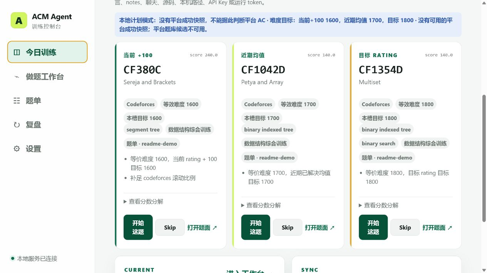
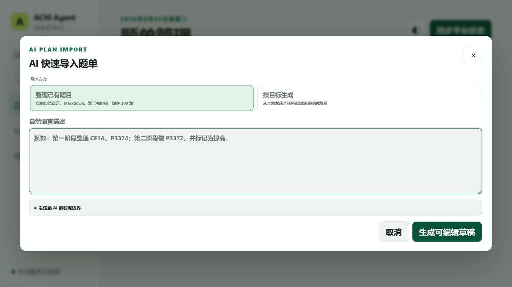
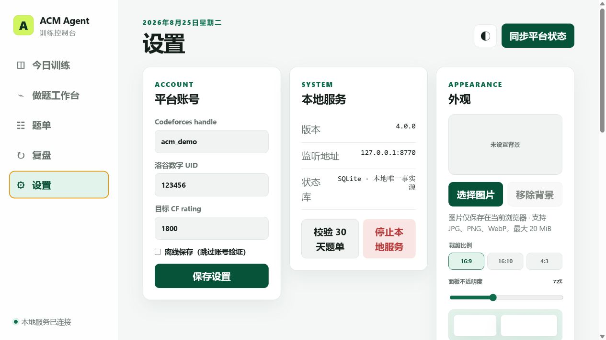

# ACM Agent

一个 local-first 的 ACM/ICPC 训练控制台。它把 Codeforces、洛谷公开做题状态、训练题单、可解释推荐、C++ 验证、复盘与可选 AI 辅助统一到本地 SQLite 中。

核心服务基于 Python 3.13 标准库实现，无需 npm、外部数据库或额外 Python 依赖；网页只监听 `127.0.0.1`。

## 运行界面

> 以下截图使用隔离的演示工作区，不包含个人账号、提交记录、源码路径或运行令牌。







## 核心能力

- 同步 Codeforces 官方 API 与洛谷公开页面；失败时保留最后一次成功快照。
- 按难度目标、薄弱专题、复做到期、近期重复与平台平衡生成可解释推荐。
- 严格区分 `accepted`、`attempted`、`local_only` 和“已掌握但未实现”的 `skipped`。
- 管理多份渐进式题单，支持 JSON 导入、AI 快速导入、编辑、启停、导出和修订恢复。
- 创建并复用 `YYYY/M/D/题号.cpp`，完成 C++17 编译、样例检查、sanitizer 探测与有限本地对拍。
- 可选 DeepSeek BYOK：知识覆盖推荐、按题保存的渐进提示、代码诊断/补丁与 Markdown 总结。
- 自定义控制台背景、裁剪比例和面板透明度；图片只保存在当前浏览器。
- 提供同一套本地网页 API、CLI JSON 与仓库级 `acm-workflow` skill，便于 Agent 协作。

## 环境要求

- Python 3.13
- 现代浏览器
- 可选：支持 C++17 的 `g++`，仅在编译和验证时需要
- 在线同步或 AI 功能所需的网络连接

## 快速开始

Windows：

```powershell
.\acm.ps1 web
```

也可以双击 `start-acm-web.cmd`。

Linux / macOS：

```bash
chmod +x acm.sh start-acm-web.sh
./start-acm-web.sh
```

服务默认从 `127.0.0.1:8765` 开始寻找可用端口并自动打开浏览器。首次使用时填写 Codeforces handle、洛谷数字 UID 和可选的目标 CF rating；离线保存不会验证账号或同步平台状态。

## 题目推荐逻辑

确定性推荐按三题一组循环：

1. **当前 +100**：当前 CF rating 加 100。
2. **近期均值**：Codeforces 与洛谷各取最近最多 50 道不同已解决题，换算后合并求平均。
3. **目标 Rating**：设置中的目标 CF rating。

每个槽位先比较题目与目标难度的距离，再结合薄弱专题、复做到期、近期重复和平台平衡决胜。推荐卡会展示目标难度、总分、分项和选择原因。

平台 AC 与本地明确记录的 `close --result AC` 都算已解决；重复 AC 只计一次。源码文件存在仅表示 `local_only`，不会被误判为 AC。新题推荐排除 AC 与 active Skip，复习模式只选择到期的 AC 题。

默认 `balanced` 将题单与平台题库合并为普通候选池。题单身份、日期和 Level 只控制资格与展示，不额外加权；也可切换为仅题库或仅题单。

可选 AI 推荐提供两种模式：

- **查漏补缺**：优先覆盖不同 AC 题数较少的知识板块。
- **专项强化**：优先深挖已有较多 AC 的知识板块。

AI 只能在确定性候选池内选择和排序，不能恢复 AC/Skip 题、绕过来源约束或创造题号；模型或协议失败时会回退到同模式的确定性结果。

## 一次训练闭环

1. 同步平台状态并生成下一组训练。
2. 从推荐卡或工作台启动题目；已有同名源码会直接复用，不覆盖。
3. 在 `.acm/cases/<problem-key>/` 放置样例并运行验证。
4. 可选使用按题隔离的 AI 对话，请求 1–3 级提示或 4 级代码诊断；补丁始终先预览、再确认应用。
5. 结束时记录结果、独立思考时间、最高提示等级、失败类型和备注。
6. 在复盘页查看到期复做、近七天结果、薄弱专题和 Skip 列表；Markdown 总结需要单独预览并确认写入。

本地随机对拍只会使用同目录下手写的 `<ID>.bf.cpp` 与 `<ID>.gen.cpp`。可通过 `--stress-iterations` 和 `--seed` 控制规模与复现种子；失败输入、输出和复现命令保存在 `.acm/failures/`。

## AI 题单导入

题单页的“AI 快速导入”提供两种显式模式：

- **整理已有题目**：从自然语言、Markdown、题号或官方链接中识别并去重，最多 200 题。模型只负责标题、说明和阶段编排，结果必须是输入题目的严格排列，不能增加、遗漏或重复题目。
- **按目标生成**：根据训练目标提出公开题号，默认 12 题、最多 30 题；服务端再按本地目录与完成状态过滤。进行中题目始终排除，AC 与 Skip 默认排除，生成过程不会隐式联网同步。

两种模式都遵循同一条写入链：

```text
AI 生成草稿 → 本地校验 → 用户编辑 → 重新校验 → 显式确认导入
```

AI 预览不会创建题单文件或数据库记录。题数不足时会保留可编辑的部分草稿，但禁用直接导入；题单 revision 冲突时必须重新预览，不会覆盖较新的修改。

调用前，界面会说明发送边界：会发送用户主动输入的目标文本；不会发送账号、UID、提交详情、源码、聊天、现有题单、本机路径、API Key 或运行 token。

## 控制台背景设计

“设置 → 外观”支持：

- 选择 JPG、PNG 或 WebP 图片，最大 20 MiB。
- 按 `16:9`、`16:10` 或 `4:3` 裁剪，并调整取景与缩放。
- 将内容面板不透明度设置为 60%–92%。
- 一键移除背景或恢复默认外观。

背景图片和外观参数只保存在当前浏览器的本地存储中，不写入 SQLite，也不会上传到服务端。界面使用清晰前景与模糊填边适配不同宽高比，并为窄屏、减少透明度和强制高对比度提供降级显示。

## DeepSeek BYOK

AI 功能只在用户显式点击或执行 AI 命令时调用。Windows Dashboard 可直接保存 DeepSeek API Key，服务使用当前用户作用域的 DPAPI 加密；明文不进入 JSON、SQLite、日志、浏览器存储或 API 响应。Linux/macOS 可使用进程环境变量 `DEEPSEEK_API_KEY`，不会退化为明文落盘。

支持 `deepseek-v4-flash` 与 `deepseek-v4-pro`。推荐关闭 thinking；对话、补丁、题单生成与 Markdown 总结按各自设置运行，`reasoning_content` 不展示也不保存。

工作台对话按 active attempt 与题目隔离并持久化。清除对话会归档旧会话而非删除审计事实；补丁应用和回退都受源码哈希保护，外部修改发生后不会被覆盖。

## Skip：已掌握但未实现

只有在未看题解、已经具备完整正确思路且明确不需要实现时，才应记录 Skip。

- Skip 会退出新题推荐并计入渐进式题单进度。
- Skip 不创建源码、session、attempt 或复做任务，也不是 AC。
- Skip 不能满足题单中的 AC 替换条件，可随时撤销。
- 已 AC 或存在 active session 的题不能 Skip。

## 本地数据与隐私

运行状态位于被 Git 忽略的 `.acm/`：

```text
.acm/
├── config.json       # 平台账号与目标 rating
├── state.db          # SQLite 状态库
├── cache/            # 平台缓存
├── plans/            # 导入题单与托管覆盖
├── cases/            # 本地样例
├── build/            # 编译产物
├── failures/         # 对拍失败资产
├── ai-backups/       # AI 补丁前的源码备份
└── web-runtime.json  # 端口、PID 与临时访问令牌
```

源码位于 `YYYY/M/D/`，用户注册的 Markdown 知识目标可位于其他本机目录。这些内容和 `.acm/` 都属于私人数据，不应提交到公开仓库。

AI 推荐只发送分类后的去重平台 AC 摘要与确定性候选；工作台对话才会发送当前题面、有效标签、源码、attempt 和最近对话。所有 AI 界面都会在发送前展示对应的数据边界。

## 常用 CLI

```powershell
.\acm.ps1 sync --json
.\acm.ps1 next --count 3 --mode mixed --json
.\acm.ps1 next --ai --ai-mode gap_fill --json
.\acm.ps1 start CF1234A --json
.\acm.ps1 verify CF1234A --stress-iterations 200 --seed 1 --json
.\acm.ps1 close CF1234A
.\acm.ps1 review week --json
.\acm.ps1 plan list --json
```

Linux/macOS 将 `.\acm.ps1` 换成 `./acm.sh`。完整参数见：

```bash
python -m tools.acm_agent --help
```

## Agent 协作

仓库包含 `.agents/skills/acm-workflow`。支持该格式的 Agent 会优先使用本地结构化 API，在 Dashboard 未运行时回退到 CLI `--json`，并遵守 AC、Skip、提示等级、AI 发送边界与确认式写入规则。

## 开发与测试

```bash
python -m unittest discover -s tests -v
python -m compileall -q tools tests
python -m tools.acm_agent plan check --json
```

测试使用固定脱敏夹具，不依赖实时平台。GitHub Actions 在 Python 3.13 的 Windows 与 Ubuntu 环境运行检查。

## 平台说明

Codeforces 同步使用官方匿名 API。洛谷公开页面没有稳定性承诺，因此解析器包含结构守卫，页面变化或网络失败时会保留最后一次成功状态。本项目与 Codeforces、洛谷均无隶属或官方合作关系。

## License

[MIT](LICENSE)
